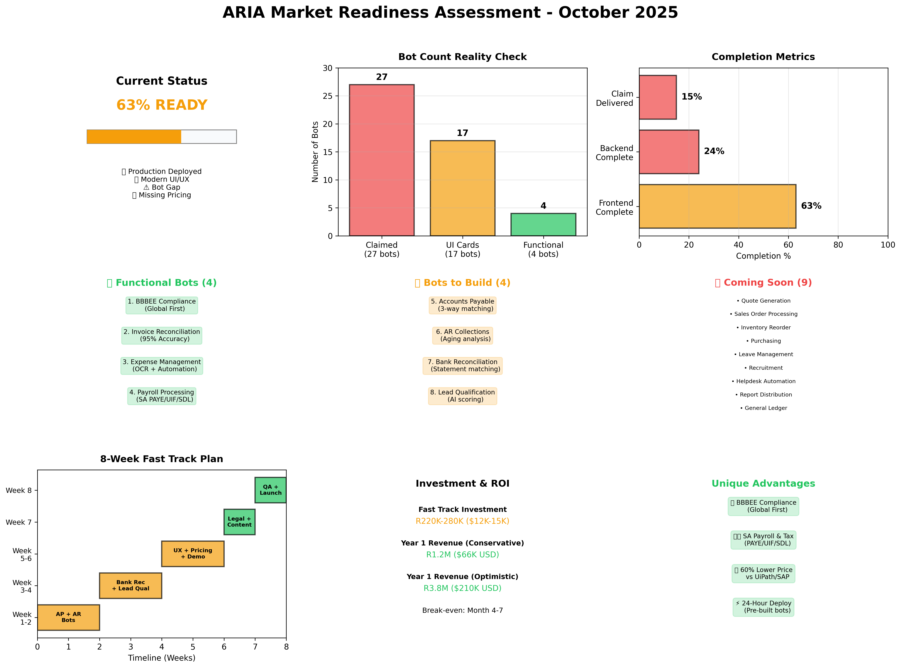
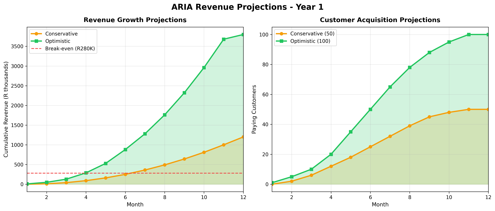

# 📊 ARIA Market Readiness Analysis - October 2025

## Overview
This folder contains a comprehensive market readiness assessment for ARIA's automated AI bot capability, comparing ARIA to the market and identifying what needs to be completed for market launch.

---

## 📁 Documents in This Analysis

### 1. **START_HERE_MARKET_READINESS.md** ⭐ (START HERE)
**Quick start guide (1 page)**
- Status overview: 63% ready
- Bot reality check: 4 functional vs. 27 claimed
- Fast track 8-week plan
- Investment: R220K-280K
- Launch date: December 20, 2025

👉 **READ THIS FIRST** for a quick executive summary

---

### 2. **EXECUTIVE_SUMMARY_REALITY_CHECK.md**
**Executive summary with visual progress indicators (271 lines)**
- Current status breakdown
- Critical gaps analysis
- Fast track vs. full launch comparison
- Revenue projections (R1.2M-3.8M Year 1)
- 8-week action plan
- Go-to-market strategy

👉 **READ THIS SECOND** for detailed strategic recommendations

---

### 3. **ARIA_MARKET_READINESS_REALITY_CHECK_OCT_2025.md**
**Comprehensive analysis document (658 lines)**
- Detailed market comparison (UiPath, SAP, M-Files, Odoo)
- ARIA's unique value propositions
- Complete bot inventory (what exists vs. what's claimed)
- Detailed development estimates (per bot, per feature)
- Risk assessment
- Financial projections (conservative vs. optimistic)
- Full 10-12 week roadmap

👉 **READ THIS THIRD** for complete technical and business analysis

---

## 📊 Visual Dashboards

### **aria_market_readiness_dashboard.png**
9-panel visual dashboard showing:
- Current status (63% ready)
- Bot count reality (27 claimed → 17 UI → 4 functional)
- Completion metrics (frontend, backend, claim delivery)
- Functional bots (4 done)
- Bots to build (4 needed)
- Coming soon (9 bots)
- 8-week timeline
- Investment & ROI
- Unique advantages



---

### **aria_revenue_projections.png**
Revenue and customer acquisition projections:
- **Conservative:** R1.2M revenue, 50 customers by Month 12
- **Optimistic:** R3.8M revenue, 100 customers by Month 12
- Break-even analysis (Month 4-7)



---

## 🎯 Key Findings

### Current Status: **63% READY**

```
✅ WORKING WELL:
- Production deployment with SSL (https://aria.vantax.co.za)
- Modern tech stack (FastAPI + React + PostgreSQL 16)
- Professional UI/UX design
- 4 functional bots (BBBEE, Invoice, Expense, Payroll)

⚠️ CRITICAL GAPS:
- 13 out of 17 bots have NO backend code (UI-only)
- Marketing claims 27 bots, only 4 are functional (15% delivery)
- No pricing defined
- No interactive demo
- Missing legal docs (T&Cs, Privacy Policy)
- No knowledge base
```

---

## 🚀 Recommended Path: Fast Track Launch

### Launch with **8 functional bots** in **6-8 weeks**

#### ✅ Already Done (4 bots):
1. BBBEE Compliance (global first)
2. Invoice Reconciliation (95% accuracy)
3. Expense Management (OCR + automation)
4. Payroll Processing (SA PAYE/UIF/SDL)

#### 🔨 Need to Build (4 bots):
5. Accounts Payable (3 weeks)
6. AR Collections (2 weeks)
7. Bank Reconciliation (2 weeks)
8. Lead Qualification (2 weeks)

#### 📅 Coming Soon - Phase 2 (9 bots):
- Quote Generation
- Sales Order Processing
- Inventory Reorder
- Purchasing
- Leave Management
- Recruitment
- Helpdesk Automation
- Report Distribution
- General Ledger

---

## 💰 Investment Required

### Fast Track (Recommended):
- **Cost:** R220K-280K ($12K-15K USD)
- **Timeline:** 6-8 weeks
- **Launch:** December 20, 2025
- **Deliverable:** 8 production-ready bots

### Full Launch (Conservative):
- **Cost:** R430K-490K ($24K-27K USD)
- **Timeline:** 10-12 weeks
- **Launch:** Late January 2026
- **Deliverable:** All 17 bots

**Recommendation: GO FAST TRACK** ⚡

---

## 📈 Revenue Projections (Year 1)

### Pricing Strategy:
```
STARTER:       R2,999/month  (~$170)   - 5 users, 3 bots
PROFESSIONAL:  R8,999/month  (~$500)   - 20 users, 10 bots
ENTERPRISE:    R20K+/month   (~$1,100+) - Unlimited users, all bots
```

### Conservative Scenario:
- **Year 1 Revenue:** R1.2M ($66K USD)
- **Customers by Month 12:** 50
- **Break-even:** Month 6-7

### Optimistic Scenario:
- **Year 1 Revenue:** R3.8M ($210K USD)
- **Customers by Month 12:** 100
- **Break-even:** Month 4-5

**ROI on Investment:** 3-5x in Year 1

---

## 🏆 ARIA's Unique Competitive Advantages

### 1. **BBBEE Compliance Bot** (Global First)
- Only platform globally with automated BBBEE compliance tracking
- Market: 100,000+ SA companies need BBBEE compliance
- ROI: R95K annual savings per company

### 2. **SA-Specific Payroll & Tax**
- PAYE/UIF/SDL calculations built-in
- SARS eFiling integration
- Market: 50,000+ SA SMEs need payroll automation

### 3. **60% Lower Price than UiPath/SAP**
- UiPath/SAP: R50K-100K/year
- ARIA: R10K-30K/year
- Target: SA SMEs (50-500 employees)

### 4. **24-Hour Deployment**
- Pre-built bots vs. 6-month RPA projects
- No coding required
- No consultants needed

---

## ⏱️ 8-Week Fast Track Action Plan

| Week | Focus | Deliverables |
|------|-------|--------------|
| **1-2** | Bot Development | AP bot, AR bot, test all 6 bots |
| **3-4** | More Bots + API | Bank Rec bot, Lead Qual bot, API endpoints |
| **5-6** | UX + Pricing | 17 bot pages, demo, pricing, billing |
| **7** | Content + Legal | T&Cs, Privacy Policy, knowledge base |
| **8** | QA + Launch | Testing, security audit, soft launch |

**Target Launch: December 20, 2025** 🚀

---

## 🎯 Market Comparison

| Platform | Pre-built Bots | SA-Specific | Pricing/Year | ARIA Position |
|----------|----------------|-------------|--------------|---------------|
| **UiPath** | 150+ | ❌ | $50K-100K | Behind (bot count), but 60% cheaper |
| **SAP Intelligent RPA** | 60+ | ❌ | $30K-100K | Behind, but BBBEE advantage |
| **M-Files** | 30+ | ❌ | $15K-60K | Competitive (doc mgmt) |
| **Odoo** | 30+ modules | ⚠️ Partial | $180-360/user | Different approach |
| **ARIA** | **8 functional** | ✅ YES | $10K-30K | **Best SA-specific value** |

---

## 🎬 Go-to-Market Strategy

### Target Audience:
- **Primary:** SA SMEs (50-500 employees) in finance, manufacturing, retail
- **Pain Points:** Manual BBBEE compliance, invoice processing, payroll
- **Budget:** R10K-50K/month for automation
- **Decision Makers:** CFO, COO, Finance Director

### Marketing Message:

**Headline:**  
> "Automate Your Back Office with AI Bots Built for South Africa"

**Sub-headline:**  
> "Deploy BBBEE compliance, payroll, invoicing, and 5 other automation bots in 24 hours. No coding. No consultants. Just results."

**Call to Action:**  
> "Start Your 14-Day Free Trial"

### Marketing Channels:
1. **SEO:** Target "BBBEE automation", "SA payroll software", "invoice automation SA"
2. **LinkedIn Ads:** CFOs, Finance Directors in SA (R20K-40K/month)
3. **Content Marketing:** Blog posts on BBBEE compliance, SARS eFiling
4. **Partnerships:** Accounting firms, ERP consultants
5. **Webinars:** "How to Automate BBBEE Compliance in 24 Hours"

---

## ⚠️ Key Risks & Mitigations

| Risk | Impact | Mitigation |
|------|--------|------------|
| **Bot functionality gap** | High | Launch with 8 bots, label 9 as "Coming Soon" |
| **Pricing not defined** | High | Define pricing Week 5, test with pilots |
| **No demo environment** | Medium | Build BBBEE + Invoice demo Week 6 |
| **UiPath/SAP competition** | Medium | Focus on SME market + BBBEE advantage |
| **Technical debt** | Medium | Allocate 20% dev time to QA/refactoring |

---

## 📞 Next Steps

### This Week:
1. ✅ Review this analysis with stakeholders
2. ⏳ Get buy-in on Fast Track plan
3. ⏳ Allocate R220K-280K budget
4. ⏳ Assign 2 developers + 1 designer

### Next Week:
1. ⏳ Start bot development sprint
2. ⏳ Build Accounts Payable bot
3. ⏳ Build AR Collections bot

### By December 20, 2025:
1. ⏳ Launch ARIA with 8 production-ready bots
2. ⏳ Acquire 10 pilot customers (14-day trials)
3. ⏳ Validate product-market fit
4. ⏳ Plan Phase 2 (build remaining 9 bots in Q1 2026)

---

## 📋 Task Tracker

All 22 tasks are tracked in the project task management system:
- ✅ 4 tasks completed (analysis, documentation)
- ⏳ 18 tasks remaining (bot development, UX, legal, launch)

See full task list in project session: `sessions/*/TASKS.md`

---

## 🎯 Bottom Line

**Current Status:** ARIA is 63% ready for market  
**Critical Gap:** Only 4 functional bots vs. 27 claimed  
**Recommendation:** Fast Track launch with 8 bots  
**Investment:** R220K-280K ($12K-15K USD)  
**Timeline:** 6-8 weeks  
**Launch Date:** December 20, 2025 🚀  
**Expected Year 1 Revenue:** R1.2M-3.8M ($66K-210K USD)  
**Confidence Level:** **HIGH** ✅  
**Risk Level:** **LOW-MEDIUM** (with Fast Track plan)  

---

**Prepared by:** AI Analysis Team  
**Date:** October 27, 2025  
**Version:** 1.0  
**Repository:** github.com/Reshigan/Aria---Document-Management-Employee  
**Production URL:** https://aria.vantax.co.za  

---

## 📚 Document Index

1. ⭐ **START_HERE_MARKET_READINESS.md** - Quick start (1 page)
2. 📊 **EXECUTIVE_SUMMARY_REALITY_CHECK.md** - Executive summary (271 lines)
3. 📖 **ARIA_MARKET_READINESS_REALITY_CHECK_OCT_2025.md** - Full analysis (658 lines)
4. 📊 **aria_market_readiness_dashboard.png** - Visual dashboard
5. 📈 **aria_revenue_projections.png** - Revenue & customer charts
6. 📋 **MARKET_READINESS_README.md** - This file

**Total Analysis:** 1,200+ lines of strategic analysis + 2 visual dashboards
